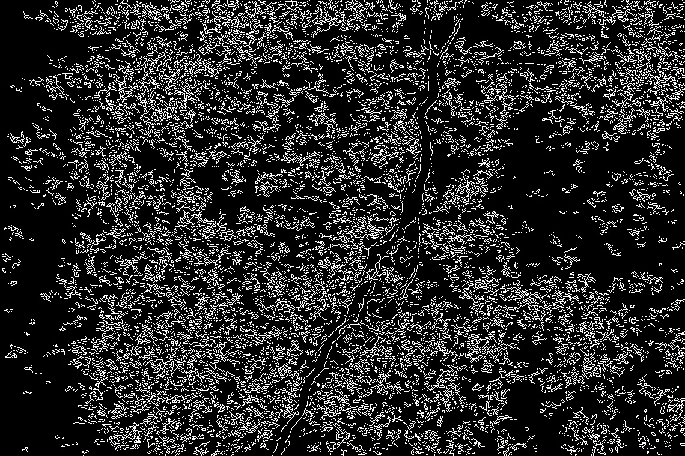

# Simple Crack Detection using Image Processing

A Python-based tool that uses the **Canny Edge Detection** algorithm to identify and highlight cracks in concrete structures.

## 📸 Results
| Original Image | Detected Crack |
|---|---|
|  |  |

## 🚀 How to Run
1. Install OpenCV: `pip install opencv-python`
2. Run the script: `python detection.py`
